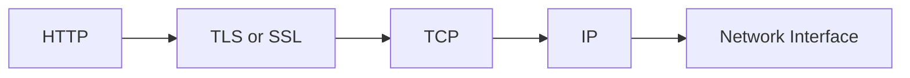

## TCP 커넥션

전 세계의 모든 HTTP 통신은 TCP/IP를 통해 이루어진다.  
일단 커넥션이 맺어지면 클라이언트와 서버는 HTTP 메시지를 주고받을 수 있다. 메시지들은 손실 혹은 손상되거나 순서가 바뀌지 않는다.  
TCP는 신뢰성 있는 전송 프로토콜이다.

### 신뢰할 수 있는 데이터 전송 통로인 TCP

TCP는 신뢰할 수 있는 데이터 전송 통로를 제공한다.  
TCP 커넥션의 한쪽에 있는 바이트들은 반대쪽으로 순서에 맞게 정확히 전달된다.

### TCP 스트림은 세그먼트로 나뉘어 IP 패킷을 통해 전송된다.

TCP는 IP패킷 이라고 불리는 작은 조각을 통해 데이터를 전송한다.  
HTTP는 IP, TCP, HTTP로 구성된 프로토콜 스택에서 최상위 계층이다.  
HTTPS는 IP, TCP, SSL/TLS, HTTP로 구성된다.

HTTP가 메시지를 전송하고자 할 경우 TCP 커넥션을 통해서 메시지 데이터를 순서대로 보낸다.  
TCP는 메시지를 일정한 크기의 조각(세그먼트)으로 나누고, 세그먼트를 IP 패킷라고 불리는 봉투에 담아서 인터넷을 통해 전송한다.

- IP 패킷이 포함하는 것
    - IP 패킷 헤더(보통 20바이트)
    - TCP 세그먼트 헤더(보통 20바이트)
    - TCP 데이터 조각(0 혹은 그이상 바이트)

IP 헤더는 발신지와 목적지 IP 주소, 크기, 기타 플래그를 가진다.
TCP 헤더는 TCP 포트 번호, TCP 제어 플래그, 데이터의 순서와 무결성을 검사하는 숫자값을 가진다.

### TCP 커넥션 유지하기

컴퓨터는 TCP 커넥션을 여러 개 가지고 있다.  
TCP 커넥션은 네 가지 값으로 식별한다.  
`<발신지 IP 주소, 발신지 포트 번호, 수신지 IP 주소, 수신지 포트 번호>`  이 네가지 값으로 유일한 커넥션을 생성한다.  

### TCP 소켓 프로그래밍 
운영체제는 TCP 커넥션의 생성과 관련된 여러 기능을 제공한다.  
이러한 기능을 사용하기 위해서는 TCP 소켓 프로그래밍을 해야한다.  
소켓 API는 유닉스 운영체제 용으로 개발되었지만 지금은 다양한 구현체로 인해 다양한 운영체제와 프로그래밍 언어에서 사용할 수 있다.

소켓 API를 사용하면 TCP endpoint 데이터 구조를 생성하고, 원격 서버의 TCP endpoint와 연결하여 데이터 스트림을 읽고 쓸 수 있다.  

~~mermaid로 클라이언트와 서버가 TCP 소켓 인터페이스를 사용하여 상호작용하는 방법~~

## TCP의 성능에 대한 고려 

### HTTP 트랜잭션 지연 
HTTP 트랜잭션을 처리하는 시간은 TCP커넥션을 설정하고, 요청을 전송하고, 응답 메시지를 보내는 것에 비하면 상당히 짧다.  
너무 많은 데이터를 처리하지 않는 이상 HTTP 지연은 TCP 네트워크 지연 때문에 발생한다. 

## 문제 
1. IP 패킷이 무엇인지, IP 패킷 포함하는 정보를 포함하여 설명하시오. 
2. TCP 커넥션 핸드셰이크 지연에 대해 설명하시오.  
3. Keep-Alive 커넥션에 대해 설명하시오.